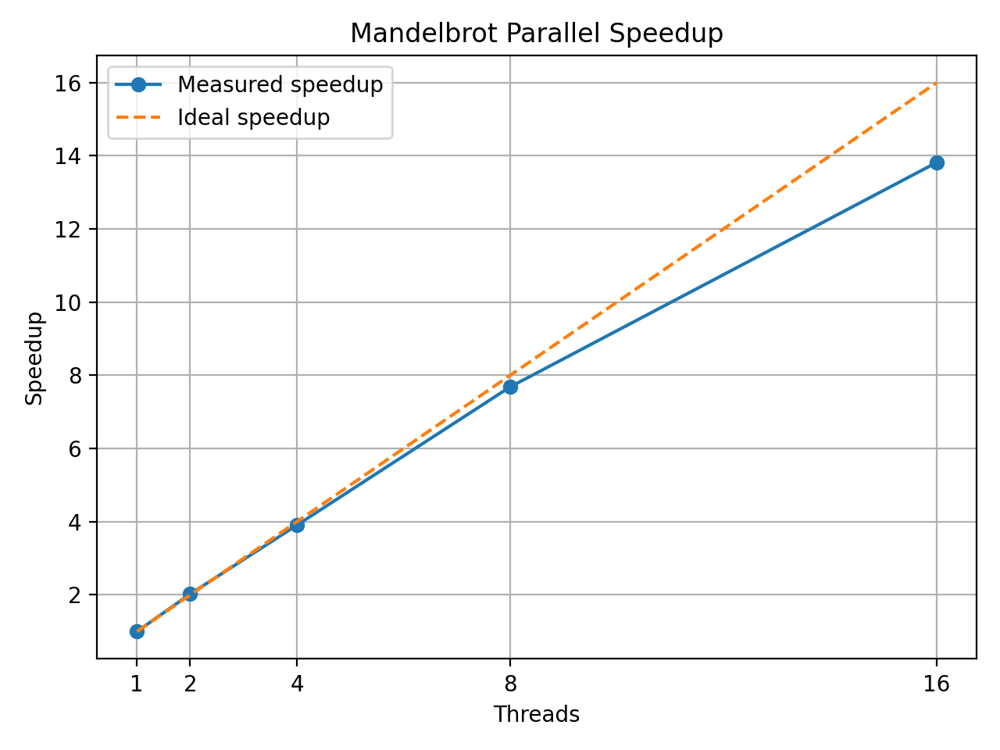
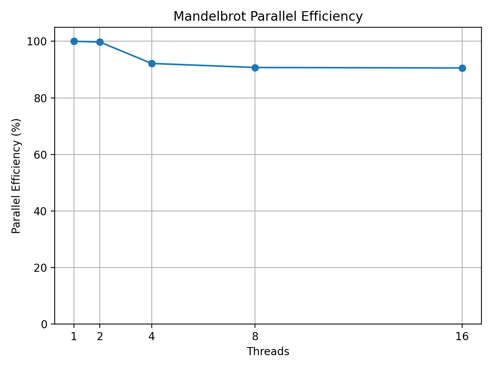
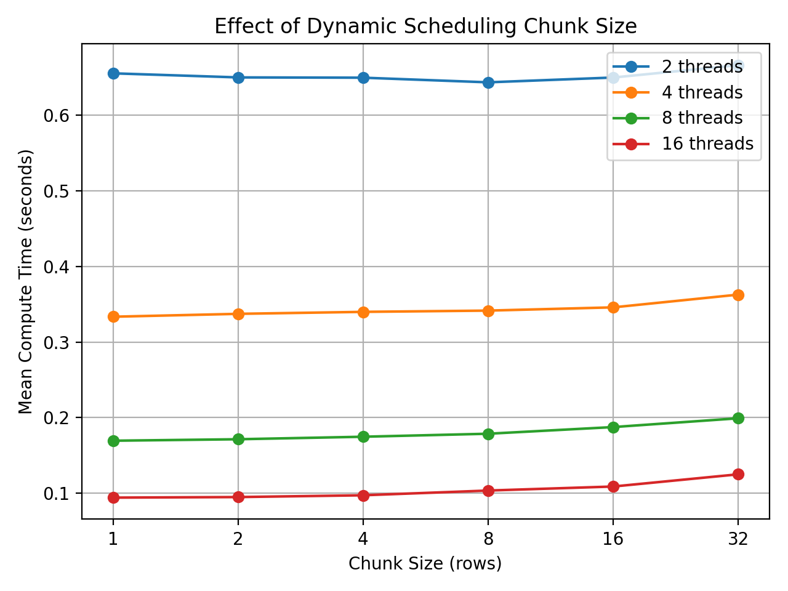

# Mandelbrot Renderer

A configurable Mandelbrot set renderer written in C, with smooth
histogram-based colouring and a multithreaded pthread implementation.

The project explores both fractal rendering and parallel CPU computation,
including dynamic work scheduling and benchmarking across different thread
counts and scheduler chunk sizes.

## Features

- Serial Mandelbrot renderer
- POSIX threads (`pthreads`) implementation
- Dynamic row scheduling for improved load balancing
- Configurable scheduler chunk size
- Per-thread histograms with reduction
- Smooth escape-time colouring
- Histogram-based colour distribution
- Gamma correction
- Configurable image resolution
- Configurable maximum iteration count
- Manual complex-plane bounds
- Centre/zoom navigation
- Wall-clock performance measurement
- Automated benchmarking
- Speedup and parallel-efficiency analysis
- Gnuplot image generation

## Project Structure

```text
mandelbrot/
├── include/
│   └── mandelbrot.h
├── plot/
│   ├── mandel.gp
│   ├── mandel.dat
│   └── mandel.png
├── results/
│   ├── benchmark_results.csv
│   ├── benchmark_summary.csv
│   ├── benchmark_scaling.csv
│   ├── benchmark_speedup.png
│   ├── benchmark_efficiency.png
│   └── benchmark_chunk_size.png
├── scripts/
│   ├── benchmark.sh
│   └── analyse_benchmark.py
├── src/
│   ├── main.c
│   ├── mandelbrot_core.c
│   ├── mandelbrot_colour.c
│   └── mandelbrot_output.c
├── Makefile
└── README.md
```

## Building

The renderer requires a C compiler with pthread support.

```bash
make
```

To clean the build:

```bash
make clean
```

## Rendering

A basic render can be generated with:

```bash
./mandelbrot
gnuplot plot/mandel.gp
```

### Example

```bash
./mandelbrot \
    --width 1500 \
    --height 1500 \
    --iterations 5000 \
    --gamma 3.5 \
    --center-x -0.743643887 \
    --center-y 0.131825904 \
    --zoom 100 \
    --threads 8 \
    --chunk-size 4

gnuplot plot/mandel.gp
```

## Command-Line Options

General options:

```text
--width <pixels>       Image width
--height <pixels>      Image height
--iterations <count>   Maximum iterations
--gamma <value>        Colour gamma correction
--threads <count>      Number of worker threads
--chunk-size <rows>    Rows assigned per scheduler request
--no-output            Skip colouring and output generation
```

Manual bounds:

```text
--xmin <value>
--xmax <value>
--ymin <value>
--ymax <value>
```

Centre/zoom navigation:

```text
--center-x <value>
--center-y <value>
--zoom <value>
```

Manual bounds and centre/zoom navigation cannot be used simultaneously.

## Parallel Implementation

Mandelbrot rendering has an irregular computational workload. Points that
escape quickly require relatively little computation, while points near or
inside the Mandelbrot set may require many iterations.

A simple static division of image rows can therefore produce load imbalance
between threads.

The pthread renderer uses a shared dynamic scheduler. Worker threads repeatedly
request chunks of rows until the entire image has been processed.

Each worker also maintains a private histogram. These histograms are reduced
into the final global histogram after the worker threads complete, avoiding
fine-grained locking during pixel computation.

## Performance

The benchmark workload used:

```text
Resolution: 1500 x 1500
Maximum iterations: 5000
Centre: (-0.743643887, 0.131825904)
Zoom: 100
```

Each configuration was measured five times.

| Threads | Best Chunk Size | Mean Time (s) | Speedup | Efficiency |
|--------:|----------------:|--------------:|--------:|-----------:|
| 1 | - | 7.098 | 1.00x | 100.0% |
| 2 | 16 | 3.558 | 1.99x | 99.7% |
| 4 | 1 | 1.925 | 3.69x | 92.2% |
| 8 | 4 | 0.978 | 7.26x | 90.7% |
| 16 | 1 | 0.490 | 14.49x | 90.6% |

The 16-thread implementation reduced compute time from approximately
**7.10 seconds to 0.49 seconds**, corresponding to approximately
**14.5x speedup** while retaining around **90.6% parallel efficiency**.

### Parallel Scaling



The pthread implementation scales from a mean serial compute time of
7.098 seconds to 0.490 seconds using 16 logical CPUs, achieving a
14.49x speedup.



Parallel efficiency remains above 90% at both 8 and 16 threads for the
best measured scheduler configurations.

### Dynamic Scheduling



Smaller scheduler chunks generally perform better at higher thread counts.
Although larger chunks reduce synchronization frequency, they also reduce
the scheduler's ability to balance the irregular Mandelbrot workload.

## Benchmarking

Run the benchmark suite with:

```bash
./scripts/benchmark.sh
```

Raw results are written to:

```text
results/benchmark_results.csv
```

Analyse the results with:

```bash
python3 scripts/analyse_benchmark.py
```

This generates summary data and performance figures in `results/`.

## Future Work

Possible extensions include:

- Additional dynamic scheduling strategies
- SIMD/vectorised Mandelbrot computation
- Process-based parallel implementation
- Direct PNG output
- Additional colour palettes
- Render presets
- Higher precision for deep zooms
- GPU implementation using CUDA or OpenCL
